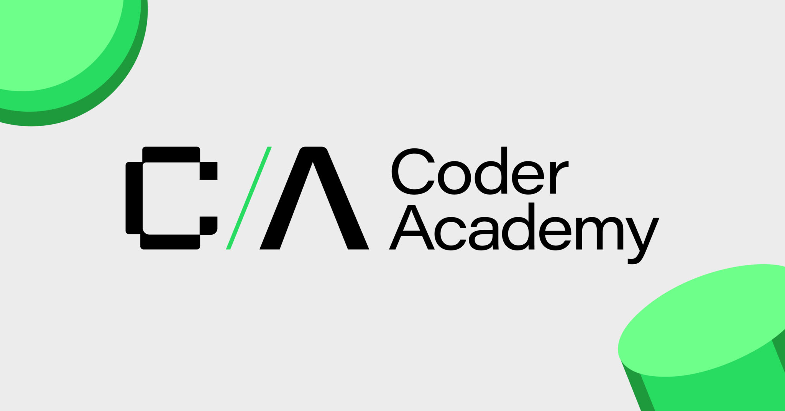

# Portolio 

## Overview
This is a portfolio website to display some services of the company "name of company". This is currently under development. We will keep on adding those featuress in readme that we add on the website


## Components

### Header
Header is the components at the top of the website. It contains logo, name and naviagation bar. 
Here is the code for the header we have.

```html
    <header>
        <div class="logo-name">
            <a href="./index.html">
            
        </a>
        <p class ="name">
            <span class="coder-text">Coder</span>
            <span class="academy-text">Acdemy</span>
        </p>
        </div>
        <nav id="nav-items">
            <a href="./index.html">Home</a>
            <a href="./pages/about.html">About</a>
            <a href="./pages/contact.html">Contact</a>

        </nav>
    </header>


```


### Footer
Footer has some social media links and some contact information
Here is the code for the footer

```html
<footer>
    <div class="social-media">
        <a href="https://www.facebook.com" target="_blank">
            <i class="fa-brands fa-facebook"></i>
        </a>
        <a href="https://www.github.com" target="_blank">
            <i class="fa-brands fa-github"></i>
        </a>
        <a href="https://linkedin.com" target="_blank">
            <i class="fa-brands fa-linkedin"></i>
        </a>
    </div>
    <div class="info">
        <p>Contact:0000000</p>
        <p>Adress:4000000</p>
    </div>
</footer>

```